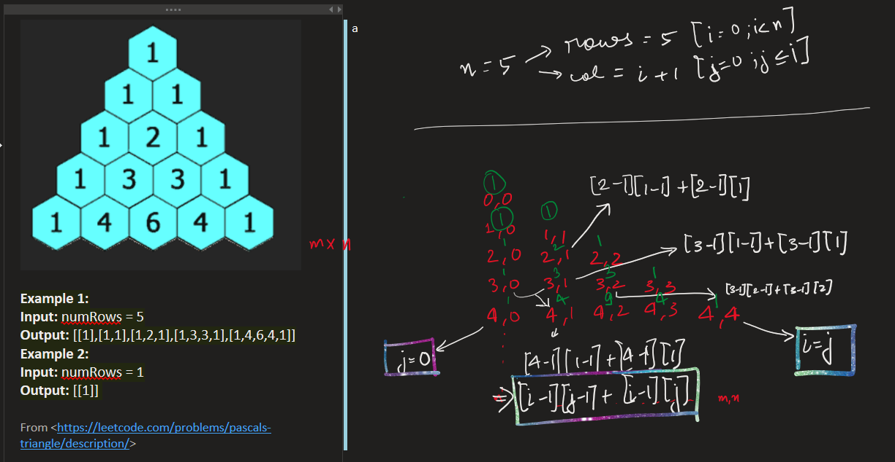

# 🧠 Arrays – Key Concepts & Mistakes

### 🔢 10. Set Matrix Zeroes 
🔗 [Leetcode Link](https://leetcode.com/problems/set-matrix-zeroes/)

#### ✅ Approaches

1. **Brute Force**
   - If cell = 0 → mark entire row & col as -1, later convert -1 to 0.
   - TC=(n*m)(n+m)+(n*m) ~ n^3

2. **Better**
   - Use row[n], col[m] arrays to mark 0s
   - Second pass: if row[i] or col[j] marked → set matrix[i][j] = 0
   - TC: O(2*n*m), SC: O(n + m)

3. **Optimal (In-place)**
   - Use matrix[0][j] & matrix[i][0] to mark → save space
   - Track `col0` separately (first col is shared with [0][0])
   - 3 passes: mark → update (1,1..n,m) → fix first row & col
   - TC: O(2*n*m), SC: O(1)

#### 💡 Key Insight
> Use first row & col to store 0 info, but protect col0 separately.

#### ❗Mistakes

#### 🔺 11. Pascal's Triangle  
🔗 [LeetCode Link](https://leetcode.com/problems/pascals-triangle/)

**Goal:** Generate `numRows` of Pascal’s Triangle.

**Logic:**  
- First & last elements of each row = 1  
- Others: `A[i][j] = A[i-1][j-1] + A[i-1][j]`

**Steps:**  
- For each row `i`:  
  - Init row of size `i+1`, set `row[0] = row[i] = 1`  
  - Loop `j = 1` to `i-1`: fill using formula above

🖼️ 

**TC:** O(n²) **SC:** O(n²)

**Mistake:** Off-by-one indexing while accessing `i-1` row

- 
